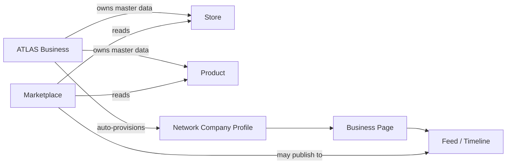

# ATLAS Network — Business Social Network

**Second core pillar of ATLAS by NEXAR NETWORK**

> Not Facebook. Not LinkedIn. A **Business Social Network** built around companies, professionals, and commerce — not lifestyle social media.

---

## Mission

Every company, employee, entrepreneur, investor, supplier, partner, and freelancer lives inside **ATLAS Network** — connected to **Business** (master data) and **Marketplace** (sales channel).

---

## Architecture

| Layer | Location |
|-------|----------|
| Bounded context | `atlasNetwork` (`domains/map.ts`) |
| Module | `modules/atlas-network/` |
| Database prefix | `atlas_network_*` |
| Port contract | `AtlasNetworkPort` (`domains/contracts/ports.ts`) |
| Permissions | `network:*` (`domains/permissions/matrix.ts`) |
| Events | `network.*` (`domains/events/catalog.ts`) |

### Relationship to Business



**Rule:** Network never owns Product, Store, or Business aggregates. It references them.

---

## Root Entities

| Entity | Table | Notes |
|--------|-------|-------|
| Profile | `atlas_network_profiles` | Root identity on the network |
| CompanyProfile | `atlas_network_company_profiles` | 1:1 with `businesses` |
| PersonProfile | `atlas_network_person_profiles` | 1:1 with `profiles` (users) |
| Organization | `atlas_network_organizations` | Optional umbrella |
| Connection | `atlas_network_connections` | Business ↔ Business, etc. |
| Follow | `atlas_network_follows` | Profiles, pages, communities |
| Post | `atlas_network_posts` | All post types incl. article, announcement |
| Comment | `atlas_network_comments` | Nested, threaded |
| Reaction | `atlas_network_reactions` | Like, celebrate, insightful, … |
| Share | `atlas_network_shares` | Share, repost, quote |
| Bookmark | `atlas_network_bookmarks` | Saved posts |
| Tag / Hashtag | `atlas_network_tags`, `atlas_network_hashtags` | Discovery |
| Community / Page | `atlas_network_communities`, `atlas_network_pages` | Business pages |
| Event / Poll | `atlas_network_events`, `atlas_network_polls` | Linked to posts |
| Conversation / Message | `atlas_network_conversations`, `atlas_network_messages` | Legacy social DMs — collaboration lives in **ATLAS Connect** |
| Activity / Timeline | `atlas_network_activities`, `atlas_network_timeline_entries` | Unified feed index |
| Moderation | `atlas_network_reports`, `blocks`, `mutes` | Trust & safety |

---

## Profile Types

`business`, `employee`, `founder`, `investor`, `partner`, `supplier`, `customer`, `creator`, `developer`

---

## Auto-Provisioning

When a **Business** is created (`businesses` INSERT):

1. DB trigger `businesses_ensure_network_profile` creates network profile + company profile + page
2. App service `ensureCompanyNetworkProfile()` mirrors idempotently
3. Domain event `network.company_profile_created` is emitted

---

## Domain Events

| Event | When |
|-------|------|
| `network.profile_created` | Person profile created |
| `network.company_profile_created` | Company page provisioned |
| `network.follow_created` | Follow action |
| `network.connection_requested` | Connection request |
| `network.connection_accepted` | Connection accepted |
| `network.post_created` | Post published |
| `network.activity_recorded` | Cross-module activity (product, store, …) |

Subscribers registered in `instrumentation.ts` via `registerAtlasNetworkEventHandlers()`.

---

## Permissions (summary)

| Permission | Typical grant |
|------------|---------------|
| `network:profile:read` | All authenticated users |
| `network:post:create` | Business owners, marketing roles |
| `network:page:manage` | Business owners/admins |
| `network:connect` | Professionals |
| `network:message:send` | Chat participants |
| `network:moderate` | Platform admins |

Full matrix: `domains/permissions/matrix.ts`

---

## API Contracts (ports)

```typescript
interface AtlasNetworkPort {
  getProfileById(id: string): Promise<NetworkProfileRecord | null>;
  getProfileByBusinessId(businessId: BusinessId): Promise<NetworkProfileRecord | null>;
  ensureCompanyProfile(input: {...}): Promise<NetworkProfileRecord>;
}
```

Implementation: `createAtlasNetworkPort()` in `modules/atlas-network/service.ts`

---

## Integration Points

| Module | Integration |
|--------|-------------|
| Business | Auto company profile on business.created |
| Marketplace | Consumes business/product refs in posts; never owns masters |
| Wallet | Message types ready for invoice/payment (future) |
| AI | Reads profiles, posts, messages for recommendations (future) |
| Notifications | Subscribes to `network.*` events (future) |
| Mobile | Port-based API surface |

---

## UI Roadmap (Phase 3+)

1. Network home / unified feed
2. Company page (About, Products, Feed, Employees)
3. Professional profile editor
4. Connection & follow UX
5. Post composer (product, job, event types)
6. Social messaging UI (legacy Network DMs — prefer Connect for collaboration)
7. Discovery & global search
8. Moderation admin

**Phase 2 delivers foundation only — no UI.** Collaboration UX belongs to [ATLAS Connect](./ATLAS-CONNECT.md).

---

## Related

- [ATLAS Constitution](./ATLAS.md)
- [ATLAS Connect](./ATLAS-CONNECT.md)
- [Architecture](./architecture.md)
- [Modules](./modules.md)
