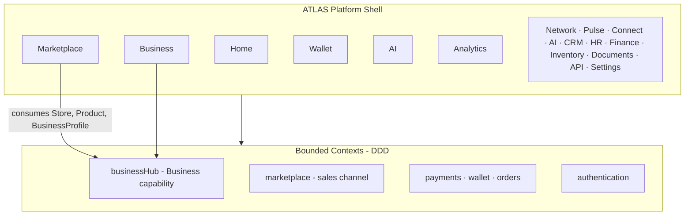
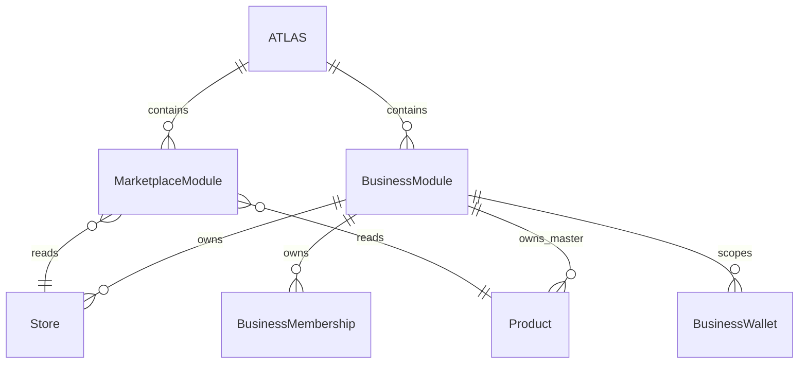

# ATLAS — Platform Constitution

**ATLAS by NEXAR NETWORK**  
**Business Operating System · Web2 + Web3**

> This document is the official constitution of the ATLAS platform.  
> Phase 1 establishes architecture and branding. Feature modules evolve under this charter.

---

## Vision

Build the world's first **Business Operating System** — not another storefront, CRM, or ERP clone. ATLAS unifies how companies run operations, sell, pay, collaborate, and grow on-chain and off-chain under one identity: **NEXAR NETWORK**.

## Mission

ATLAS gives every business a single operating layer:

- One **Business** identity (profile, stores, products, people, verification, settings)
- Many **capabilities** (Marketplace, Wallet, Finance, AI, Analytics, Network, …)
- One **permission model** and one **event stream**
- Zero duplicated master data across modules

Marketplace is a **sales channel**. It never owns the business.

---

## What ATLAS Is — and Is Not

| ATLAS is | ATLAS is not |
|----------|----------------|
| A Business Operating System | A Shopify / Alibaba clone |
| A modular platform shell | A single-purpose e-commerce site |
| Web2 operations + Web3 settlement | A crypto demo with fake modules |
| Long-horizon enterprise architecture | A CRUD prototype |

---

## Platform Identity

| Field | Value |
|-------|--------|
| Product name | **ATLAS** |
| Attribution | **by NEXAR NETWORK** |
| Category | Business Operating System |
| Internal platform id | `atlas` |
| Config | `config/atlas-branding.ts`, `config/atlas-nav.ts` |
| Domain layer | `domains/atlas.ts` |

Public surfaces use **ATLAS**. Internal code may retain `businessHub`, `modules/business-hub/`, and `business_hub` DB identifiers for backward compatibility.

---

## Architecture

### Layer model



### Principles

1. **System before screens** — domain model, ownership, contracts, permissions, events first
2. **Single source of truth** — each aggregate owned by exactly one bounded context
3. **Clean Architecture** — Repository → Service → Server Actions → UI
4. **Monolith-first, extract-ready** — modules communicate via `domains/contracts`
5. **Event-driven analytics** — metrics derive from domain events, not duplicated truth tables

### Stack (current)

| Layer | Technology |
|-------|------------|
| Platform shell | Next.js 16 App Router, React 19, TypeScript |
| Identity | Auth.js |
| Data | PostgreSQL (Supabase), Prisma ORM |
| Domain map | `domains/map.ts`, `domains/ownership.ts` |
| Permissions | `domains/permissions/matrix.ts` |

---

## ATLAS Module Tree

Every module belongs to ATLAS. Root navigation is defined in `config/atlas-nav.ts`.

```
ATLAS
├── Home
├── Business          ← company aggregate (internal: Business Hub)
├── Marketplace       ← sales channel only
├── Network
├── Pulse             ← Business Intelligence Feed
├── Connect           ← Business Collaboration Platform
├── Wallet
├── AI
├── Analytics
├── Documents
├── CRM
├── HR
├── Finance
├── Inventory
├── API
└── Settings
```

### Business module (formerly Business Hub)

**Public name:** Business  
**Internal context:** `businessHub`  
**Code:** `modules/business-hub/`

Contains:

- Business Profile, Stores, Products, Services
- Employees, Verification, Business Settings
- Membership, Permissions
- Business Wallet, Business Analytics, Business AI Context

Database: `businesses`, `business_memberships`, `stores.business_id`, `products.business_id`.

### Marketplace module

**Role:** Sales channel only.

- Owns: Listing, Cart, Wishlist, Storefront, Discovery, Reviews (presentation layer)
- Consumes: Store, Product, Business profile from **Business**
- Never writes Product or Store master records

---

## Ownership Matrix (summary)

| Aggregate | Owner context | Notes |
|-----------|---------------|--------|
| Business, Store, Product (master) | `businessHub` | Business capability |
| Listing, Cart, Storefront | `marketplace` | Consumes Business |
| Order, Payment, Invoice | `orders`, `payments` | Commerce transactions |
| Wallet, Ledger | `wallet` | Money movement |
| User, Session | `authentication` | Identity |

Full matrix: `domains/ownership.ts`.

---

## Relationships



**Rule:** If Marketplace needs product data, it reads through Business tenancy — it does not create a parallel Product entity.

---

## Business Philosophy

1. **The company is the center** — not the store, not the marketplace listing
2. **Channels are interchangeable** — Marketplace today; partners, API, POS tomorrow
3. **Permissions follow membership** — platform role + business role via `resolvePermissions()`
4. **Verification is a Business state** — synced with merchant KYC, not a separate product
5. **Web3 is infrastructure** — wallet and token modules serve Business, not the reverse

---

## Backward Compatibility (Phase 1)

| Item | Status |
|------|--------|
| `modules/business-hub/` path | Unchanged |
| `businessHub` bounded context key | Unchanged |
| `business_hub` migration IDs | Unchanged |
| `/merchant/*`, `/marketplace/*` routes | Unchanged |
| Database schema | No changes in Phase 1 |
| Business Hub foundation | Valid — do not rebuild |

---

## Future Roadmap

### Phase 1 — Platform rebranding ✅ (current)
- ATLAS identity, module tree, docs, shell branding strings
- No UI redesign, no new features

### Phase 2 — ATLAS Network foundation ✅
- Business Social Network bounded context, schema, module, events, permissions
- Auto company profile on Business creation
- No UI yet

### Phase 3 — ATLAS Pulse foundation ✅
- Business Intelligence Feed bounded context, schema, module, ranking & recommendation engines
- Event ingestion from Business, Network, Marketplace, Catalog
- Auto feed + timeline provisioning on Business creation
- No UI yet

### Phase 4 — ATLAS Connect foundation ✅
- Business Collaboration Platform bounded context, schema, module, smart actions, realtime contracts
- Auto workspace + default channels on Business creation
- Communication → business actions (task, lead, invoice, meeting, …)
- No UI yet

### Phase 5 — ATLAS AI foundation ✅
- Business Intelligence Engine bounded context, schema, agents, memory, vector, workflows
- Auto AI workspace + system agents on Business creation
- Provider-agnostic LLM-ready ports; event-driven automations
- No UI yet

### Phase 6 — ATLAS Marketplace foundation ✅
- Commerce Engine sales channel: storefronts, listings (product refs), checkout, shipments, promos
- Never owns Product/Store masters — Business Hub remains source of truth
- Auto storefront + listing projection on Business/Product events
- No UI yet

### Phase 7 — ATLAS Apps foundation ✅
- Business Applications Platform: catalog, installs, versions, developers, permissions, monetization schema
- Plugin / sandbox / SDK-ready contracts; business-scoped install lifecycle
- AI recommendation stubs; no forced ERP suite on Business creation
- No UI yet

### Phase 8 — ATLAS Finance foundation ✅
- Financial Operating System: workspaces, COA, double-entry journals, tax, budgets, reports
- Consumes Invoice/Payment/Wallet masters — never duplicates them
- Auto Finance workspace + standard COA on Business creation; payment.confirmed → GL
- No UI yet

### Phase 9 — ATLAS Mobile foundation ✅
- Complete mobile platform: devices, sessions, push, offline queue, sync, deep links, camera stubs
- Same business/data/permissions via ports — not a companion app
- Offline-first conflict strategies; push fan-out from domain events
- No native UI / app store builds yet

### Phase 10 — NXR Token Ecosystem foundation ✅
- Digital economy layer: NXR accounts, ledger, rewards, loyalty, treasury, optional billing intents
- Blockchain-agnostic — adapters prepared (Ethereum/BNB/Polygon/Solana/NEXAR), not implemented
- Consumes fiat Wallet masters — never duplicates them; NXR remains optional
- No UI yet

### Phase 11 — ATLAS Core Integration ✅
- One Platform / One Brain: `modules/atlas-core` orchestration, outbox dual-write, unified timeline/search/analytics
- Notification hub fan-out; workflow audit for flagship events
- Emit bridges: `product.published` (catalog), `order.paid` / `payment.confirmed` (payment finalize)
- No new product features — integration only

### Phase 12 — Production Readiness ✅
- Removed Wallet Super Admin entirely — sole admin plane is Platform Owner → NEXAR HQ → RBAC
- Platform Owner Wizard (no hardcoded passwords); password change + 2FA gates
- HQ RLS + feature flags / maintenance settings migration
- Marketing route foundations: Pricing, Blog, Developers, Documentation
- See [PHASE-12-PRODUCTION-READINESS.md](./PHASE-12-PRODUCTION-READINESS.md)

### Phase 13 — ATLAS Polish ✅ (current)
- Unified design tokens (spacing, motion, status colors, focus rings)
- Official ATLAS lockup integrated across navbar, auth, loaders, sidebars, HQ login, favicons
- Branded empty / loading / system status surfaces (404, 401, 403, 500, offline, network)
- Micro-interactions + `prefers-reduced-motion` respect
- See [PHASE-13-ATLAS-POLISH.md](./PHASE-13-ATLAS-POLISH.md)

### Phase 14 — ATLAS shell navigation
- Unified root nav from `config/atlas-nav.ts`
- Module switcher in `DashboardShell` (incl. HQ icon for Platform Owner only)
- Role-aware module visibility

### Phase 15 — Business module UI
- Business profile, members, settings surfaces
- Deprecate “Merchant” language in UX

### Phase 16 — Satellite module UI (+ mobile clients)
- Network, Pulse, Connect, AI, Marketplace, Apps, Finance, NXR, Documents, CRM, HR

### Phase 17 — Durable outbox workers & realtime analytics dashboards
- Async outbox processor, dead-letter, idempotent consumers

### Phase 18 — API & partner / developer ecosystem
- Public API, webhooks, SDKs, chain adapter implementations

---

## Related Documentation

| Document | Purpose |
|----------|---------|
| [PHASE-13-ATLAS-POLISH.md](./PHASE-13-ATLAS-POLISH.md) | Phase 13 Premium Experience / Polish Report |
| [ATLAS-BRAND-USAGE.md](./ATLAS-BRAND-USAGE.md) | Official logo usage map + remaining legacy assets |
| [PHASE-12-PRODUCTION-READINESS.md](./PHASE-12-PRODUCTION-READINESS.md) | Phase 12 Production Readiness Report |
| [ATLAS-CORE.md](./ATLAS-CORE.md) | **ATLAS Core** — integration spine (One Brain) |
| [ATLAS-CORE-INTEGRATION-REPORT.md](./ATLAS-CORE-INTEGRATION-REPORT.md) | Phase 11 Integration & Architecture Report |
| [ATLAS-HQ.md](./ATLAS-HQ.md) | **NEXAR HQ** — sole internal administration |
| [NEXAR-HQ-MIGRATION-REPORT.md](./NEXAR-HQ-MIGRATION-REPORT.md) | Admin → NEXAR HQ migration report |
| [ATLAS-NETWORK.md](./ATLAS-NETWORK.md) | **ATLAS Network** — Business Social Network foundation |
| [ATLAS-PULSE.md](./ATLAS-PULSE.md) | **ATLAS Pulse** — Business Intelligence Feed foundation |
| [ATLAS-CONNECT.md](./ATLAS-CONNECT.md) | **ATLAS Connect** — Business Collaboration Platform foundation |
| [ATLAS-AI.md](./ATLAS-AI.md) | **ATLAS AI** — Business Intelligence Engine foundation |
| [ATLAS-MARKETPLACE.md](./ATLAS-MARKETPLACE.md) | **ATLAS Marketplace** — Commerce Engine (sales channel) foundation |
| [ATLAS-APPS.md](./ATLAS-APPS.md) | **ATLAS Apps** — Business Applications Platform foundation |
| [ATLAS-FINANCE.md](./ATLAS-FINANCE.md) | **ATLAS Finance** — Financial Operating System foundation |
| [ATLAS-MOBILE.md](./ATLAS-MOBILE.md) | **ATLAS Mobile** — Mobile Business Platform foundation |
| [ATLAS-NXR.md](./ATLAS-NXR.md) | **NXR Token Ecosystem** — Digital Economy Layer foundation |
| [architecture.md](./architecture.md) | Technical system design |
| [modules.md](./modules.md) | Domain module reference |
| [foundation.md](./foundation.md) | Cross-cutting infrastructure |
| `.cursor/rules/atlas-charter.mdc` | Agent engineering charter |

---

## Governance

All new work must:

1. Declare which **ATLAS module** it belongs to
2. Respect **aggregate ownership** in `domains/ownership.ts`
3. Use **contracts** in `domains/contracts/` for cross-module access
4. Resolve permissions through **`resolvePermissions()`**
5. Emit **domain events** for analytics and notifications

When in doubt: **Business owns truth; Marketplace sells; ATLAS orchestrates.**
