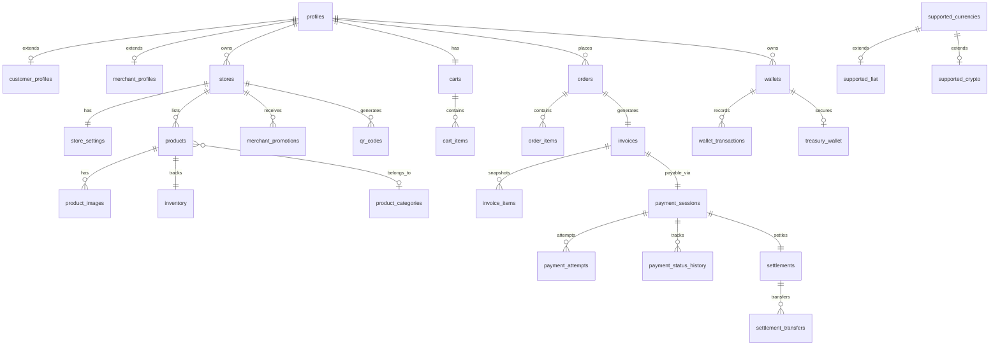

# Nexar Network — Database Architecture

PostgreSQL on Supabase. Normalized schema with RLS on every public table. Business logic lives in database functions where atomicity matters; application code calls RPCs rather than duplicating fee or payment rules.

## Schemas

| Schema | Purpose |
|---|---|
| `public` | Application tables, views, and RPC wrappers (RLS enabled on all tables) |
| `private` | Security definer helpers — fee calculation, audit logging, wallet recording (not exposed via Data API) |
| `auth` | Supabase Auth (`auth.users`, `auth.uid()`) |
| `storage` | Supabase Storage buckets and objects |

## Migration Files

| File | Contents |
|---|---|
| `20260727000000_foundation.sql` | profiles, platform_settings, fee_schedules, audit_logs, enums, private helpers |
| `20260727000001_stores.sql` | stores, merchant_promotions, store logo storage |
| `20260727000002_products_carts.sql` | products, carts, cart_items, full-text search |
| `20260727000003_orders_invoices.sql` | orders, order_items, invoices, `create_store_checkout()` |
| `20260727000004_payments.sql` | payment_sessions, payment_attempts, settlements, exchange_rates |
| `20260727000005_admin_platform.sql` | exchange rate upsert constraint |
| `20260727000006_hardening.sql` | idempotent settlement RLS policy |
| `20260727000007_database_architecture.sql` | wallets, currencies, QR codes, security logs, views, enhanced payment flow |
| `20260727000008_store_settings_trigger.sql` | Auto-create `store_settings` on store registration |
| `20260727000009_auth_payments_extension.sql` | Payment requests, invoice share links, session prefs, QR resolve RPCs |
| `20260727000010_qr_payload_backfill.sql` | Normalize legacy `nexar://` QR payloads |
| `20260727000011_cancel_pending_order.sql` | `cancel_pending_order` RPC for unpaid customer orders |
| `20260727000012_merchant_cancel_pending_order.sql` | `merchant_cancel_pending_order` RPC for store owners |
| `20260727000013_product_compare_at_price.sql` | Optional `compare_at_price` for product sale display |
| `20260727000014_auth_sessions_policy.sql` | Session insert policy + revoke RPCs |
| `20260727000015_cancel_session_status.sql` | Cancel session uses `cancelled` status |
| `20260727000016_database_completion.sql` | Sessions view, inventory sync, refund RPC, RLS gaps, schema validation |
| `20260727000017_production_performance.sql` | High-traffic indexes for payments, settlements, orders, audit |
| `20260727000018_platform_extensions.sql` | Escrow, disputes, withdrawals, coupons, webhooks, loyalty/POS/chains |
| `20260727000019_escrow_payment_integration.sql` | Escrow hold integrated into complete_payment |
| `20260727000020_realtime_search_completion.sql` | Wallet/settlement realtime + expanded global search |
| `20260727000021_production_platform_settings.sql` | Platform settings expansion, treasury seed, admin wallet challenges |

Apply with:

```bash
supabase db push
supabase migration list
```

---

## Entity Relationship Overview



---

## Tables

Every table includes `id` (UUID), `created_at`, and `updated_at` unless noted as append-only.

### Requested Entity Mapping

| Requested name | Implementation |
|---|---|
| profiles | Table `profiles` |
| customers | View over `profiles` + `customer_profiles` |
| merchants | View over `profiles` + `merchant_profiles` |
| stores | Table `stores` |
| store_settings | Table `store_settings` |
| products | Table `products` |
| product_categories | Table `product_categories` |
| product_images | Table `product_images` |
| inventory | Table `inventory` |
| shopping_cart | View over `carts` |
| cart_items | Table `cart_items` |
| orders | Table `orders` |
| order_items | Table `order_items` (append-only, no `updated_at`) |
| payments | View over `payment_sessions` |
| payment_attempts | Table `payment_attempts` |
| payment_methods | Table `payment_methods` |
| payment_status_history | Table `payment_status_history` |
| invoices | Table `invoices` |
| invoice_items | Table `invoice_items` |
| wallets | Table `wallets` |
| wallet_transactions | Table `wallet_transactions` (append-only ledger) |
| treasury_wallet | Table `treasury_wallet` (service role only) |
| platform_fees | View over `settlements` |
| exchange_rates | Table `exchange_rates` |
| supported_currencies | Table `supported_currencies` |
| supported_crypto | Table `supported_crypto` |
| supported_fiat | Table `supported_fiat` |
| merchant_promotions | Table `merchant_promotions` |
| merchant_fee_plans | Table `merchant_fee_plans` |
| qr_codes | Table `qr_codes` |
| notifications | Table `notifications` |
| audit_logs | Table `audit_logs` (append-only) |
| security_logs | Table `security_logs` |
| sessions | View over `user_sessions` |
| api_keys | Table `api_keys` (future) |
| contact_messages | Table `contact_messages` |

### Identity & Profiles

| Table / View | Description |
|---|---|
| **profiles** | Extends `auth.users`. Role (`customer` \| `merchant` \| `admin`), wallet address, profile completion |
| **customer_profiles** | Customer extension: preferred currency, total orders, total spent (USD) |
| **merchant_profiles** | Merchant extension: business name, tax ID, verification status, revenue counters |
| **customers** *(view)* | `profiles` ⋈ `customer_profiles` where role = customer |
| **merchants** *(view)* | `profiles` ⋈ `merchant_profiles` where role = merchant |

Auto-created via trigger when profile role is set to customer or merchant.

### Stores & Settings

| Table | Description |
|---|---|
| **stores** | Merchant store: name, slug, mode (`marketplace` \| `payments_only`), payout wallet |
| **store_settings** | Normalized store config: notification email, min order, accepted payment types |
| **merchant_promotions** | New merchant 50% platform fee discount for 3 months (auto-created on store activation) |
| **merchant_fee_plans** | Per-store fee overrides (falls back to global `fee_schedules`) |
| **qr_codes** | Marketplace QR and payment-only QR per store with secure token |

### Catalog

| Table | Description |
|---|---|
| **products** | Store catalog with price, stock (synced from inventory), full-text search |
| **product_categories** | Hierarchical categories per store |
| **product_images** | Multiple images per product; one primary |
| **inventory** | `quantity_on_hand`, `reserved_quantity`, low-stock threshold; syncs `products.stock` |

### Cart & Orders

| Table / View | Description |
|---|---|
| **carts** | One cart per customer |
| **cart_items** | Line items with quantity |
| **shopping_cart** *(view)* | Alias over `carts` |
| **orders** | Order lifecycle: subtotal, platform fee, merchant amount, payment method |
| **order_items** | Immutable line items at checkout time |
| **invoices** | 1:1 with orders; invoice number sequence, PDF path, due date |
| **invoice_items** | Snapshot of order items at invoice creation (trigger-populated) |

### Payments

| Table / View | Description |
|---|---|
| **payment_sessions** | Core payment entity: method, amount, deposit address, QR, 5-minute expiry |
| **payments** *(view)* | Alias with normalized status labels over `payment_sessions` |
| **payment_attempts** | On-chain or card attempts with tx hash, confirmations |
| **payment_methods** | Reference catalog: NXR, BNB, USDT, BTC, ETH, card |
| **payment_status_history** | Full status transition log (trigger-populated) |
| **settlements** | Fee breakdown: gross, platform fee, merchant amount, promotion applied |
| **settlement_transfers** | Treasury fee transfer + merchant payout records |
| **platform_fees** *(view)* | Platform fee ledger derived from settlements |

#### Payment Status Lifecycle

| Status | Meaning |
|---|---|
| `waiting` | Session open, awaiting payment (maps to *Waiting Confirmation* in view) |
| `pending` | Initial / pre-session state |
| `waiting_confirmation` | On-chain tx detected, awaiting confirmations |
| `confirmed` | Tx confirmed on chain |
| `paid` | Payment completed successfully (maps to *Completed* in view) |
| `expired` | Session timed out (5 minutes) |
| `cancelled` | Manually cancelled |
| `refunded` | Payment reversed |
| `failed` | Verification or processing failed |

### Wallets

| Table | Description |
|---|---|
| **wallets** | Customer, merchant, platform, and treasury wallets |
| **wallet_transactions** | Append-only ledger: deposits, payments, fee collections, refunds |
| **treasury_wallet** | Secure singleton config linked to treasury wallet; **RLS denies all authenticated access** — service role only |

Treasury address is stored in `platform_settings.treasury_wallet_address` and synced to the treasury wallet row via trigger. Never hardcode in application code.

### Currencies & Fees

| Table | Description |
|---|---|
| **supported_currencies** | USD, EUR, EGP, NXR, BNB, USDT, BTC, ETH (+ future) |
| **supported_fiat** | Fiat extension (ISO code) |
| **supported_crypto** | Crypto extension (chain ID, contract address) |
| **exchange_rates** | Cached rates; admin-managed, never hardcoded |
| **fee_schedules** | Global defaults: NXR 3.5%, other crypto 5%, card (provider configurable) |

Fee resolution order: `merchant_fee_plans` → `fee_schedules` → active `merchant_promotions` discount.

### Platform & Admin

| Table | Description |
|---|---|
| **platform_settings** | Singleton: treasury wallet, token addresses, support email, card provider |
| **audit_logs** | Append-only: login, payment, order update, admin action, etc. |
| **security_logs** | Failed login, blocked IP, rate limit, invalid token, permission denied |
| **notifications** | In-app notifications per user |
| **user_sessions** | Application session tracking (distinct from Supabase Auth) |
| **sessions** *(view)* | Alias over `user_sessions` |
| **api_keys** | Future API access (admin-managed, hashed keys) |
| **contact_messages** | Public contact form submissions |

---

## Atomic Payment Flow

All steps execute inside `public.complete_payment()` — a single PostgreSQL transaction. Any failure rolls back everything.

```
Customer pays
    ↓
Verify payment (service role calls complete_payment after on-chain check)
    ↓
Calculate fee (private.calculate_platform_fee)
    ↓
Record payment attempt
    ↓
Update payment_session → paid
    ↓
Update invoice → paid
    ↓
Update order → paid (platform_fee, merchant_amount)
    ↓
Create settlement → completed
    ↓
Transfer platform fee → treasury wallet (wallet_transactions + settlement_transfers)
    ↓
Transfer remaining → merchant wallet (wallet_transactions + settlement_transfers)
    ↓
Record customer payment_out transaction
    ↓
Update customer_profiles (total_orders, total_spent_usd)
    ↓
Update merchant_profiles (total_orders, total_revenue_usd)
    ↓
Write audit_log
```

Only `service_role` may call `complete_payment()` — called after backend verification.

---

## Functions

### Public RPCs (callable from app)

| Function | Caller | Purpose |
|---|---|---|
| `create_store_checkout(store_id)` | authenticated | Atomic cart → order + invoice |
| `create_payment_session(...)` | authenticated | Create payment popup session |
| `complete_payment(session_id, tx_hash, amount)` | service_role | Full atomic payment completion |
| `calculate_platform_fee(amount, method, store_id)` | authenticated | Preview fee breakdown |
| `expire_stale_payment_sessions()` | service_role / cron | Expire sessions past 5 minutes |
| `expire_merchant_promotions()` | service_role / cron | Deactivate expired promotions |
| `process_refund(order_id, reason, actor_id)` | service_role | Atomic refund with wallet reversal |
| `log_audit_event(...)` | authenticated | Standardized audit log write |
| `log_security_event(...)` | authenticated, anon | Standardized security log write |
| `validate_database_schema()` | service_role | Post-migration schema checks |

### Private Helpers

| Function | Purpose |
|---|---|
| `private.set_updated_at()` | Trigger: auto-update `updated_at` |
| `private.current_user_role()` | Read role from profiles (not JWT metadata) |
| `private.write_audit_log(...)` | Append audit entry |
| `private.calculate_platform_fee(...)` | Fee schedule + promotion logic |
| `private.record_payment_status_change()` | Trigger: log status transitions |
| `private.record_wallet_transaction(...)` | Append wallet ledger entry |
| `private.get_or_create_merchant_wallet(...)` | Ensure merchant wallet exists |
| `private.get_treasury_wallet_id()` | Return treasury wallet UUID |
| `private.log_security_event(...)` | Append security log entry |
| `private.snapshot_invoice_items()` | Trigger: copy order_items → invoice_items |
| `private.sync_product_stock_from_inventory()` | Trigger: keep products.stock in sync |
| `private.sync_treasury_address_from_settings()` | Trigger: sync treasury address |
| `private.ensure_profile_extension()` | Trigger: create customer/merchant profile |

---

## Views

| View | Purpose |
|---|---|
| `customers` | Customer-facing profile data |
| `merchants` | Merchant-facing profile data |
| `shopping_cart` | Cart alias |
| `payments` | Payment session alias with normalized status |
| `platform_fees` | Platform fee revenue from settlements |
| `v_merchant_revenue` | Per-store revenue aggregation |
| `v_customer_purchase_history` | Customer order history |
| `sessions` | Session alias over `user_sessions` |

---

## RLS Summary

RLS is enabled on **every** public table. Authorization reads `profiles.role` via `private.current_user_role()`, never JWT `user_metadata`.

| Resource | customer | merchant | admin | anon |
|---|---|---|---|---|
| profiles | own R/W | own R/W | all | deny |
| customer_profiles | own R/W | deny | all | deny |
| merchant_profiles | deny | own R/W | all | deny |
| stores | active R | own R/W | all | deny |
| store_settings | R | own R/W | all | deny |
| products / categories / images / inventory | active R | own store R/W | all | deny |
| carts / cart_items | own R/W | deny | all | deny |
| orders / order_items | own R | store R | all | deny |
| invoices / invoice_items | own R | store R | all | deny |
| payment_sessions / attempts / status_history | own R | store R | all | deny |
| settlements / transfers | deny | store R | all | deny |
| wallets / wallet_transactions | own R | own R | all | deny |
| treasury_wallet | **deny** | **deny** | **deny** | deny |
| supported_currencies / fiat / crypto | R | R | R/W | deny |
| payment_methods | R | R | R/W | deny |
| exchange_rates | R | R | R/W | deny |
| fee_schedules / merchant_fee_plans | deny | own R | R/W | deny |
| merchant_promotions | deny | own R | R/W | deny |
| qr_codes | active R | own R/W | all | deny |
| notifications | own R/W | own R/W | all | deny |
| audit_logs | own + store R | store-related R | all R | deny |
| security_logs | deny | deny | R | deny |
| user_sessions | own R/W | own R/W | all | deny |
| api_keys | deny | deny | R/W | deny |
| contact_messages | own R + insert | insert | all | insert |
| platform_settings | deny | deny | R | deny |

Service role bypasses RLS for backend operations (payment completion, treasury access, cron jobs).

---

## Triggers

| Trigger | Table | Action |
|---|---|---|
| `*_updated_at` | All tables with `updated_at` | Set `updated_at = NOW()` on UPDATE |
| `profiles_ensure_extension` | profiles | Create customer/merchant profile on role change |
| `on_store_activated` | stores | Create 3-month promotion when status → active |
| `invoices_snapshot_items` | invoices | Copy order_items to invoice_items on INSERT |
| `payment_sessions_status_history` | payment_sessions | Log status transitions |
| `inventory_sync_product_stock` | inventory | Sync `products.stock` |
| `platform_settings_sync_treasury` | platform_settings | Sync treasury wallet address |
| `products_search_vector` | products | Maintain full-text search vector |

---

## Indexes

Key indexes are created per table:

- Foreign key columns (`store_id`, `customer_id`, `order_id`, etc.)
- Status + timestamp composites for cron queries (`payment_sessions.status, expires_at`)
- Partial indexes for active records (`products.is_active`, `qr_codes.is_active`)
- Unique constraints: invoice numbers, tx hashes, one treasury wallet, one primary wallet per owner
- GIN index on `products.search_vector`

Run `scripts/rls-audit.sql` in Supabase SQL editor to verify RLS coverage in production.

---

## Validation

Run after applying all 17 migrations:

```bash
supabase db push
supabase migration list
```

In Supabase SQL Editor:

```sql
SELECT * FROM public.validate_database_schema() ORDER BY check_name;
```

Or run the full audit script: `scripts/validate-database.sql` and `scripts/rls-audit.sql`.

Expected results:
- **35** physical tables in `public` schema
- **8** views (including `sessions`)
- **0** tables without RLS
- Treasury wallet singleton present
- Fee schedules seeded: NXR 3.5%, crypto_other 5%, card 2.9%
- 8 supported currencies (USD, EUR, EGP, NXR, BNB, USDT, BTC, ETH)

Local validation (requires Docker):

```bash
docker run -d --name nexar-pg-test -e POSTGRES_PASSWORD=test -e POSTGRES_DB=nexar postgres:16-alpine
sleep 8
docker exec -i nexar-pg-test psql -U postgres -d nexar < scripts/migration-test-stubs.sql
for f in supabase/migrations/*.sql; do
  docker exec -i nexar-pg-test psql -U postgres -d nexar -v ON_ERROR_STOP=1 < "$f"
done
docker exec nexar-pg-test psql -U postgres -d nexar -c "SELECT * FROM public.validate_database_schema();"
docker rm -f nexar-pg-test
```

---

## Design Decisions

1. **No duplicate profile tables** — `customers` and `merchants` are views over `profiles` + extension tables, avoiding email/name duplication.
2. **No duplicate cart table** — `shopping_cart` is a view over `carts`.
3. **No duplicate payments table** — `payments` is a view over `payment_sessions` with status normalization.
4. **Fees never hardcoded** — all rates in `fee_schedules` / `merchant_fee_plans`; seeded defaults only in migrations.
5. **Treasury never hardcoded** — address in `platform_settings`, secure config in `treasury_wallet`; backend service role only.
6. **Wallet history never deleted** — `wallet_transactions` uses `ON DELETE RESTRICT` on wallet FK.
7. **Invoice immutability** — `invoice_items` snapshot at creation; separate from live `order_items`.
