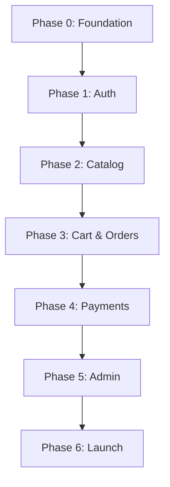

# Execution Order

Recommended sequence for implementing Nexar Network after foundation setup.

## Phase 0 — Foundation (This Prompt) ✅

1. Folder structure and barrel exports
2. Configuration modules and env validation
3. Error handling, logging, security utilities
4. Providers (Query, Web3), Zustand store scaffold
5. Form hook (`useZodForm`), shared schemas
6. Route placeholders and middleware modularization
7. Documentation

## Phase 1 — Authentication

Reference: `docs/phase-1-auth.md`

1. Wire login/register forms to `useZodForm` + module actions
2. OAuth callback and profile completion flow
3. Role-based redirects (already in middleware)
4. CSRF on mutation endpoints

## Phase 2 — Catalog & Stores

Reference: `docs/phase-2-catalog.md`

1. Merchant product CRUD via `modules/catalog`
2. Customer browse and product detail pages
3. Store management for merchants
4. Image upload via react-dropzone

## Phase 3 — Cart & Orders

Reference: `docs/phase-3-orders.md`

1. Cart add/remove/update via `modules/cart`
2. Checkout flow creating orders
3. Order status pages for customer and merchant

## Phase 4 — Payments & Settlement

Reference: `docs/phase-4-payments.md`

1. Payment session creation (crypto QR via qrcode.react)
2. Stripe Connect card payments
3. Settlement worker for on-chain verification
4. Realtime payment status updates

## Phase 5 — Invoices & Admin

Reference: `docs/phase-5-admin.md`

1. PDF invoice generation
2. Admin dashboard with recharts analytics
3. Platform fee and promotion management
4. Audit log viewer

## Phase 6 — Launch Hardening

Reference: `docs/phase-6-launch.md`

1. RLS audit (`scripts/rls-audit.sql`)
2. Security checklist review
3. Sentry production monitoring
4. Email notifications via Resend
5. Performance and load testing

## Within Each Phase

For every feature, follow this order:

```
1. Schema/validators  →  modules/<name>/validators.ts
2. Repository         →  modules/<name>/repository.ts
3. Service (if needed)→  services/<name>.service.ts
4. Server actions     →  modules/<name>/actions.ts
5. Feature hooks      →  features/<name>/hooks/
6. UI components      →  features/<name>/components/
7. Pages              →  app/ route pages (thin wrappers)
8. Tests              →  when requested
```

## Dependency Graph for Implementation



## Do Not Skip

- Validators before actions
- Repository before service
- Service before UI
- Audit logging on state-changing operations
- Error handling on every API route and server action
